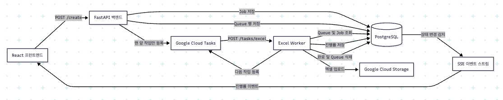
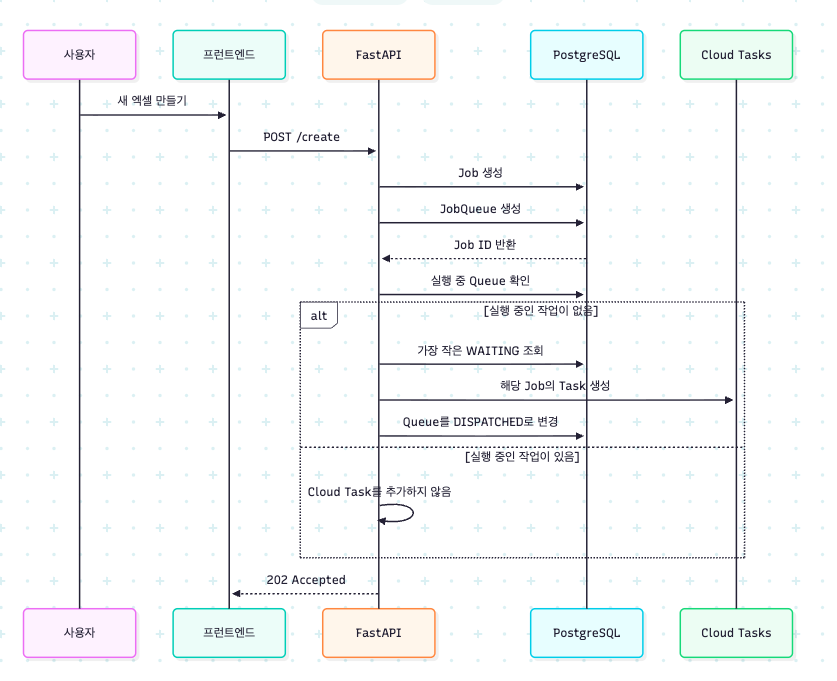
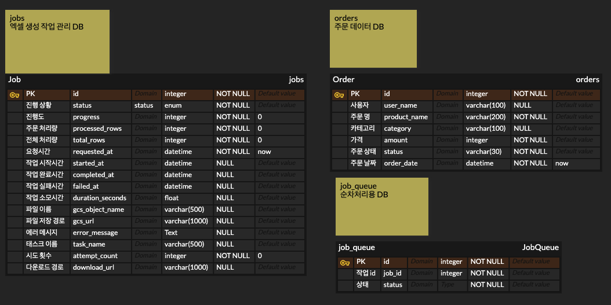

# Excel-onboarding

1. 서비스 URL
    프론트엔드 : https://ps-onboarding-frontend-1038097021464.asia-northeast3.run.app

    백엔드 : https://ps-onboarding-backend-1038097021464.asia-northeast3.run.app

2. 과제 설명 : 
    - DB의 정보를 읽고 엑셀 파일로 만드는 기능을 수행합니다.
    - 사용자의 엑셀 생성 요청은 Google Cloud Tasks로 저장됩니다.
    - 생성된 엑셀 데이터는 Google Cloud Storage에 저장됩니다.
    - 사용자는 서버에서 진행 상태를 알 수 있으며, 제공된 URL로 파일을 다운로드 가능합니다.
    - 기능이 완성될 시 디스코드 메시지로 알림을 제공합니다.

3. 아키텍처 다이어그램

4. 흐름도

5. erd

6. 포함 항목
 - Cloud Tasks 순차 처리 설정 방법 및 선택 이유

    DB를 활용, 새로운 큐를 만드는 방식으로 순차 처리를 보장할 수 있도록 하였습니다. DB에 먼저 값을 저장한 후 job_id를 바탕으로 정렬하여, 데이터의 상태에 따라 Tasks의 값을 처리할 수 있도록 하였습니다.    
 - GCS 파일 접근 방식 선택 이유

    사용자들에게 제한된 접근을 허용하기 위해 signed_URL을 활용하였습니다.
 - 프론트엔드 프레임워크 및 템플릿 선택 이유

    React를 사용하였으며, 사용자가 활용하기 좋게 구성하였습니다.

 - SSE vs 폴링 선택 이유

    SSE의 경우 진행도를 받아오는 과정에서 서버 부하가 많아지지만, 실시간 적용이 가능하여 선택하였습니다.
 - 문제 파악 및 해결

    백엔드에서 데이터를 몰아받는 상황 발생 -> 엑셀 생성 시 엑셀 생성이 많은 자원을 차지하여 다른 기능(조회, 페이지 탐색)이 잠시 멈추는 현상을 발견하였습니다. 성능 저하에 관해서 해결하는 것이 개선해야할 목표였습니다. 여러 방법을 찾아보았고, 환경까지 고려하여 이를 동시성 제어로 해결할 수 있다는 것을 알게 되었습니다.
 - 구현하지 못한 부분과 개선 방향
    
   

